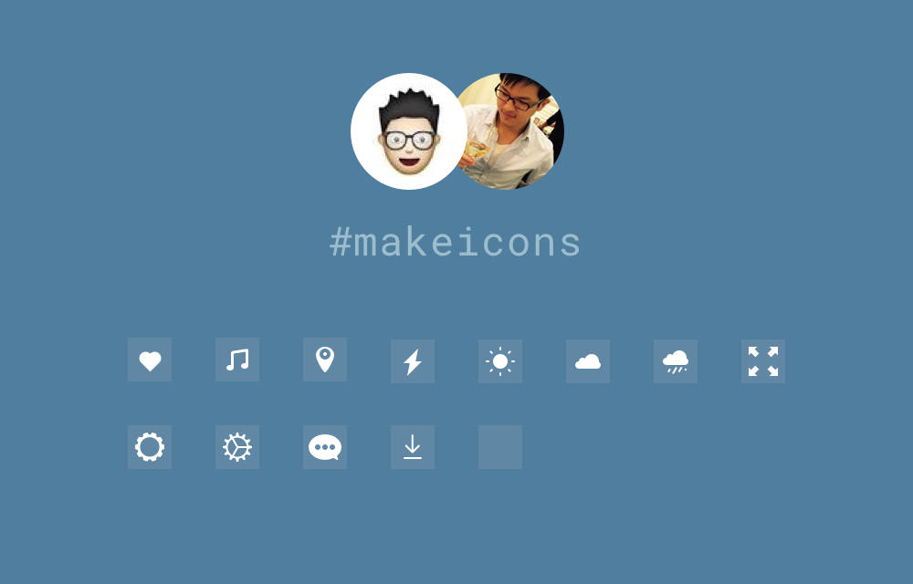

# Make Great Icons

This project is a demonstration for practicing Sketch skills by following the tutorial **#makeicons** step by step.

[#makeicons](https://twitter.com/hashtag/makeicons?src=hash) is an activity started by [Allen Wang](https://dribbble.com/openallen) by making cool icons in several simple but definitely inspirational steps. After you go through the tutorial you should be able to create your own icons fast and gracefully.

## Overview

## Icons

These icons are made in  24x24 in Sketch, you can download the svg files from [icons](icons/) folder. Also you can download the [make-icons.sketch](make-icons.sketch) and do anything to satisfy your needs.

- [001 heart](http://ww2.sinaimg.cn/mw690/460030e8gw1f7pvsp9mxtg208w08wwjg.gif) 
- [002 music](http://ww1.sinaimg.cn/mw690/460030e8gw1f7r1fxcgotg208w08wai6.gif) 
- [003 location](http://ww2.sinaimg.cn/mw690/460030e8gw1f7s5xvgfe4g20b40b4n3o.gif) 
- 004 weather
	- [lightening](http://ww1.sinaimg.cn/mw690/460030e8gw1f7t9jt2g3gg208w08w412.gif) 
	- [sunny](http://ww3.sinaimg.cn/mw690/460030e8gw1f7t9jy4vddg208w08wagu.gif) 
	- [cloudy](http://ww2.sinaimg.cn/mw690/460030e8gw1f7t9k3wpucg208w08wdkk.gif) 
	- raining 
- [005 fullscreen](http://ww4.sinaimg.cn/mw690/460030e8gw1f7tzkim800g208w08wn3i.gif) 
- 006 settings
	- [1](http://ww2.sinaimg.cn/mw690/460030e8gw1f7v2rayy22g208w08w7ci.gif) 
	- [2](http://ww4.sinaimg.cn/mw690/460030e8gw1f7v2r85x3cg208w08wh0e.gif) 
- [007 chat](http://ww4.sinaimg.cn/mw690/460030e8gw1f7walwx9bzg208w08wtfl.gif) 
- [030 download](http://ww3.sinaimg.cn/mw690/460030e8gw1f8ncx4nsqng208w08wjx2.gif) 
- more icons coming soon...

## Acknowledgements

- Thanks [Allen](https://github.com/allenwong) for sharing such a wonderful tutorial.
- [Sketch](https://www.sketchapp.com/) is incredible friendly to new beginners, I love it!